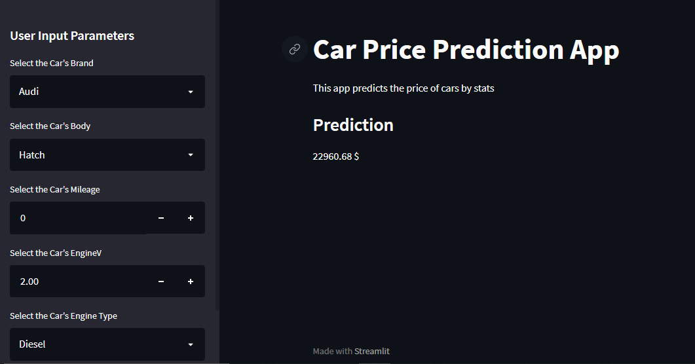
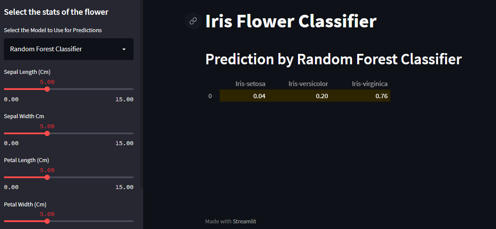
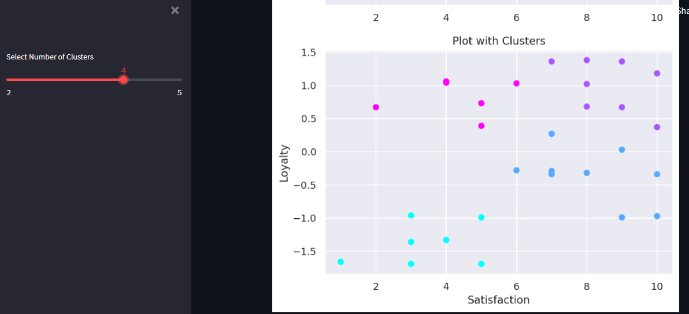

Data Science Projects - Watch in [Github.io](https://aldanajd.github.io/Data_Scientist/)

# Regression:

## Project #1: [Sales Forecasting](https://github.com/aldanajd/Data_Scientist/tree/main/Machine%20Learning/Regression/Sales_Forescasting) 

Link to the [Dashboard](https://public.tableau.com/views/SalesForecasting_16511965305110/Dashboard1?:language=en-US&:display_count=n&:origin=viz_share_link)

## Project #2: [Car Price Estimator](https://github.com/aldanajd/Data_Scientist_I/tree/main/Machine%20Learning/Regression/Cars_price_estimator)

### Model Deployed At: [Car Price Estimator Web App](https://share.streamlit.io/aldanajd/data_scientist/main/Deployment/Regression/Car_price_estimator/car_price_st.py) 

## Project #3: [GPA Estimator](https://github.com/aldanajd/Data_Scientist/tree/main/Machine%20Learning/Regression/GPA_estimator) 

# Classification:

## Project #1: [Binary Admittance](https://github.com/aldanajd/Data_Scientist_I/tree/main/Machine%20Learning/Classification/Binary_admittance)

## Project #2: [Iris Flower](https://github.com/aldanajd/Data_Scientist_I/tree/main/Machine%20Learning/Classification/Iris_Flower)

### Model Deployed At: [Iris Flower Classification Web App](https://share.streamlit.io/aldanajd/data_scientist/main/Deployment/Classification/Iris_Classifier/iris_classifier_st.py)

# Clustering:

## Project #1: [Client Segmentation](https://github.com/aldanajd/Data_Scientist_I/tree/main/Machine%20Learning/Clustering/Client_segmentation)

### Model Deployed At: [Client Segmentation Web App](https://share.streamlit.io/aldanajd/data_scientist/main/Deployment/Clustering/Multi_clustering/multi_clustering_st.py)

# Anomaly Detection:

## Project #1: [Fraud Detection](https://github.com/aldanajd/Data_Scientist_I/tree/main/Machine%20Learning/Anomaly%20Detection/Fraud%20Detection)

# Natural Language Processing and Speech:

## Project #1: [Sentiment Analysis: Steam Reviews](https://github.com/aldanajd/Data_Scientist/tree/main/Machine%20Learning/NLP/Sentiment%20Analysis/Steam%20Reviews)

## Project #2: [Text to Speech](https://github.com/aldanajd/Data_Scientist/tree/main/Machine%20Learning/NLP/Text%20to%20Speech)

## Project #3: [Speech to Text](https://github.com/aldanajd/Data_Scientist/tree/main/Machine%20Learning/NLP/Speech%20to%20Text)

# Deep Learning (In Process):

# Deep Reinforment Learning (In Process):

