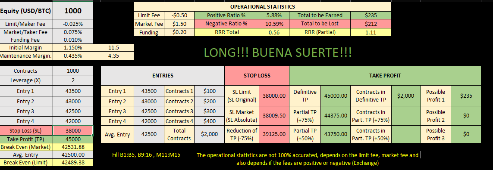
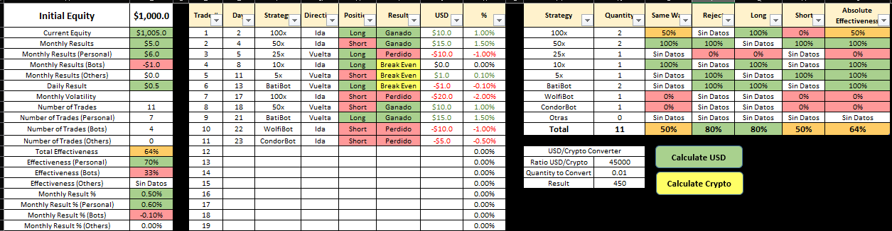
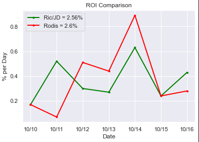
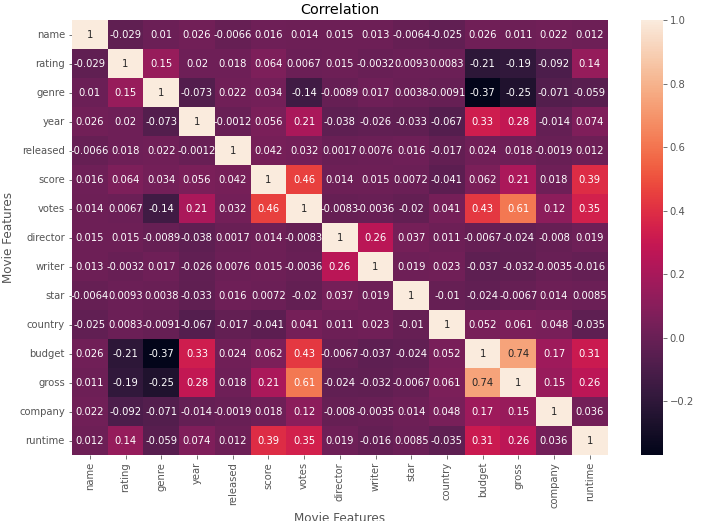

# Data_Scientist_I

Entry Level Data Scientist Projects - Watch in [Github.io](https://aldanajd.github.io/Data_Analyst_I/)

# Regression:

## Project #1: [Car Price Estimator](https://github.com/aldanajd/Data_Scientist_I/tree/main/Machine%20Learning/Regression/Cars_price_estimator)

## Project #2: [GPA Estimator](https://github.com/aldanajd/Data_Scientist_I/tree/main/Machine%20Learning/Regression/GPA_estimator) 

* Overview: A project to practice tables and VLOOKUP 

* Background: Decided to further practice the VLOOKUP knowledge

* Tables, VLOOKUP

# Classification:

## Project #1: [Intro to Python for Beginners](https://github.com/aldanajd/Data_Analyst_I/tree/main/Python%20Projects/Intro%20to%20Python%20for%20Beginners)

* Overview: A guide that contains the most used packages: pandas, numpy, matplotlib, seaborn, example of a class, keywords, functions and datasets to practice

* Background: My best and favorite project so far, not because of it's complexity but because how useful it has been for me and how it represents me. It's organized, it's helpful, It was made as a plan for the future, it's always there for when you need to check into a syntax that you might have forgotten (quicker than using stackoverflow), always updating it with new important functions

* Pandas, NumPy, Matplotlib, Seaborn, Datasets, Keywords, Functions, Classes

## Project #2: [Martin Gale Strat](https://github.com/aldanajd/Data_Analyst_I/tree/main/Python%20Projects/Martin%20Gale%20Strat)

* Overview: A simple martin gale strategy calculator 

* Background: I was once in the need to implement the 'Marting Gale Stratategy' into a trading algorithm that I also created but not going to upload it  

* Loops, Dictionaries, Calculations

## Project #3: [ROI Calculator](https://github.com/aldanajd/Data_Analyst_I/tree/main/Python%20Projects/ROI%20Calculator)

* Overview: A simple return-of-investment calculator 

* Background: I was once in the need to know the ROI of two trading algorithms 

* Pandas, calculations, lists, graphs

## Project #4: [Trades Per Second - Bybit](https://github.com/aldanajd/Data_Analyst_I/tree/main/Python%20Projects/Trades%20Per%20Second%20-%20Bybit)

* Overview: Using the API of the exchange called 'Bybit' to extract the trades made per second

* Background: Exploring the API I found ways to POST, REQUEST and DELETE everything about trading, this is one of the useful functions that I used to elaborate my own trading algorithms

* Pandas, API

## Project #5: [Correlation - Finding Insights](https://github.com/aldanajd/Data_Analyst_I/tree/main/Python%20Projects/Correlation%20-%20Finding%20Insights)

* Overview: Cleaning, exploring and then creating visualizations to find insights from a movie dataset

* Background: The need of improving my knowledge with graphs, correlations and data cleaning in python

* Pandas, Matplotlib, Seaborn, NumPy, Data cleaning, Data exploration, hypothesis testing

# Clustering:

## Project #1: [Data Exploration - Covid](https://github.com/aldanajd/Entry_level_Projects/tree/main/SQL%20Projects/1%20-%20Exploration%20with%20SQL%20-%20COVID)

* Overview: Extracted the data from [Our World in Data](https://ourworldindata.org/) and then proceeded to create tables and calculations to learn more about the covid (total deaths, total cases, total vaccines) and it's impact in the countries/continents populations

* Background: One of the most common subject out there but at the same time, one of the most important

* Cleaning, JOINS, CTE, Calculations

## Project #2: [Data Cleaning - Nashville Housing](https://github.com/aldanajd/Entry_level_Projects/tree/main/SQL%20Projects/2%20-%20Data%20Cleaning%20with%20SQL%20-%20Nashville%20Housing)

* Overview: This project really helped to feel like a data analyst, creating a plan to decide how to deal with the data applying own criteria and the most common cleaning methods

* Background: From what I have been told, from what I have read, from what I have seen, data cleaning is the most common task for data analysts

* Dealing with blanks, string to date, splitting addresses, removing duplicates, further cleaning of strings, deleting columns, etc.

# Anomaly Detection:

## Project #1: [Dashboard - Covid](https://github.com/aldanajd/Entry_level_Projects/tree/main/Tableau%20Projects/Dashboard%20-%20COVID)

* Overview: This [dashboard](https://public.tableau.com/app/profile/jorge1136/viz/CovidDashboard_16399924814070/Dashboard1?publish=yes%5D) is a representation of the [SQL Project #1: Data Exploration - Covid](https://github.com/aldanajd/Entry_level_Projects/tree/main/SQL%20Projects/1%20-%20Exploration%20with%20SQL%20-%20COVID), provides a clear way of seeing how the covid has evolved globally throught the months

* Background: It's easier to extract insights and explain the data with a clear visualization of it, Tableau's Dashboards are excellent to do so.

